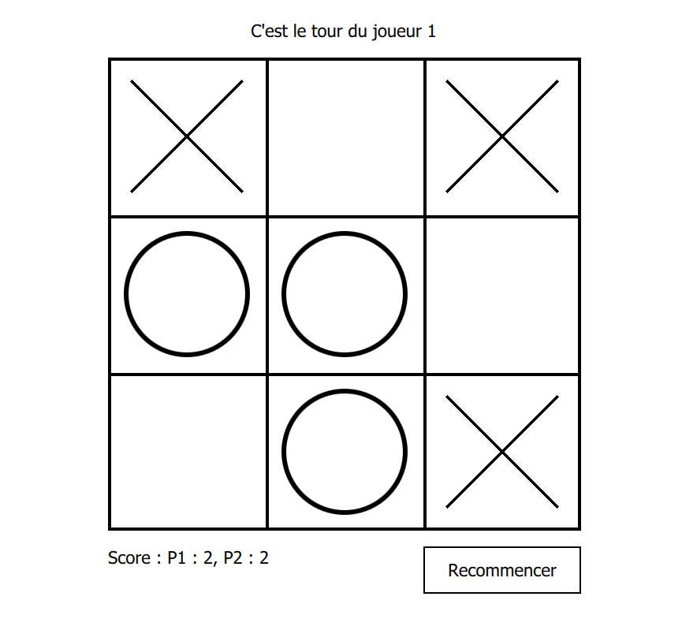

# Morpion

Demonstrate how to program a morpion with qt quick.

The project aim is to be very minimalistic and only use:

* `Window` to create the application window.
* `Rectangle` to draw all the necessary items
* `MouseArea` to handle user input
* `Text` to draw some information to the user.

This project aimed to be an example for beginner. It can even be the first app demo of qt quick. It shows the concept of

* anchors
* property binding
* javascript code integration
* Positioning element in an hierarchy.
* Create a custom qml item.

## How to build

Simply launch `morpion.pro` with qtCreator.